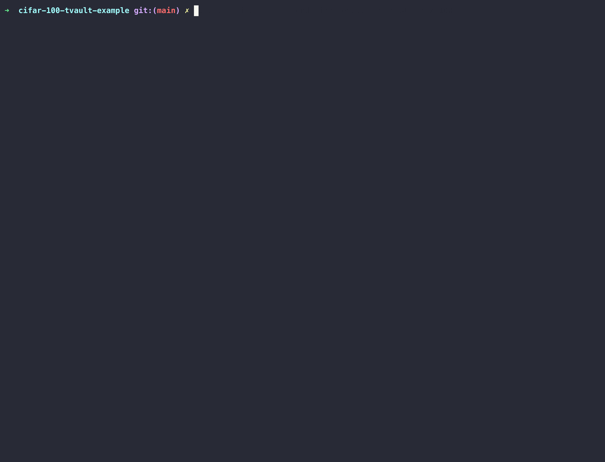
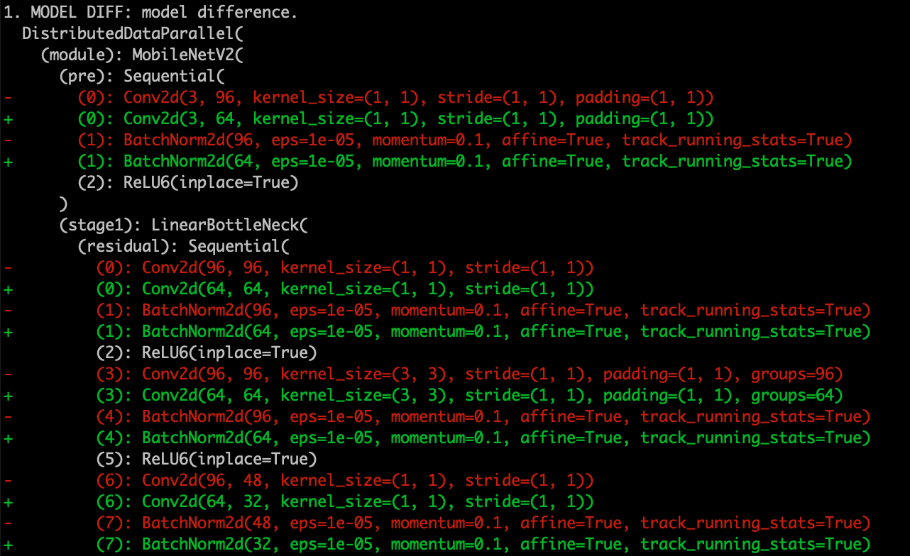

# cifar-100-tvault-example
Sample repository for classifying CIFAR-100 dataset with tvault model registry. 

## Installing tvault
`pip install tvault` 

## Description
This repository contains example usage of tvault. We use ResNet-18 model to classify MNIST dataset.
Since the purpose of the repository is to let you experience model registry, we set train epoch to 5.
In order to run experiment:

After experiment end, model registry will be created using statement in `train.py`:

`tags = {"language": "pytorch","size": "3x","learning_rate": learning_rate,"epoch": 150,"batch_size": batch_size}`

`tvault.log_all(model, tags=tags, result=acc.item(), optimizer=optimizer)`.

Note that you can add your custom tags in `tags` and apply them to your model registry. Also, you can skip all other elements for logging except for model itself.

While model registry uses the commit hash, multiple registries with different settings can be made in single commit. In this case, model indexes are used to differentiate different model experiments.

## Command line tools
Above command automatically generates model registry for your pytorch model. Your model registry (model related code, result, tag, metatdata ... ) will be saved in `model_log` directory. 

### tvault --find_flag
tvault find_flag option allows you to look up different expereiments with simple cli. find_flag offers three different ways of exploring results.

1. hash
`tvault --find_flag --condition hash --hash 2ba4adf` shows all experiments with hash `2ba4adf`. It will show all tags within the registry.

2. result
`tvault --find_flag --condition result --min 50 --max 100` shows all experiments with result value between 50 and 100.

3. tag
`tvault --find_flag --condition tag --tag_type size --tag 0.5x` shows all experiments where the tag value is `0.5x` for tag type `size`.

### tvault --diff_flag
tvault diff_flag option allows you to look up difference of two models by specifying model hash and index. tvault automatically detects functions that are realated to model, which removes git diffs that are **not** related to model.

`tvault --diff_flag --sha1 94f4c1e --index1 0 --sha2 94f4c1e --index2 1` 
provides the model difference between models in between two commits. 

Note that we have logged optimizer with the model. Hence, tvault is able to find out the diff related to optimizer.

